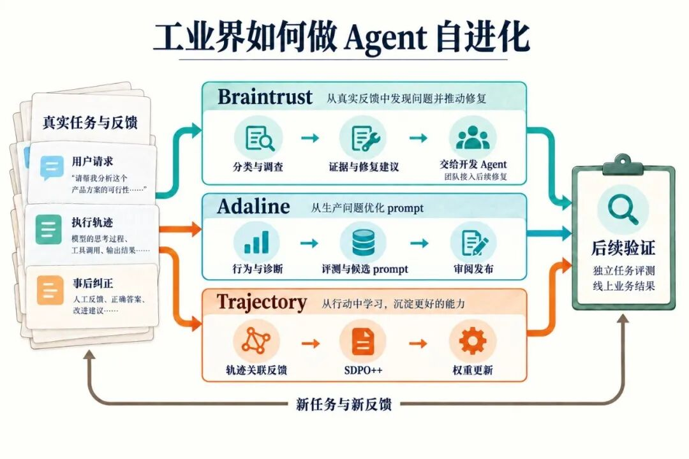
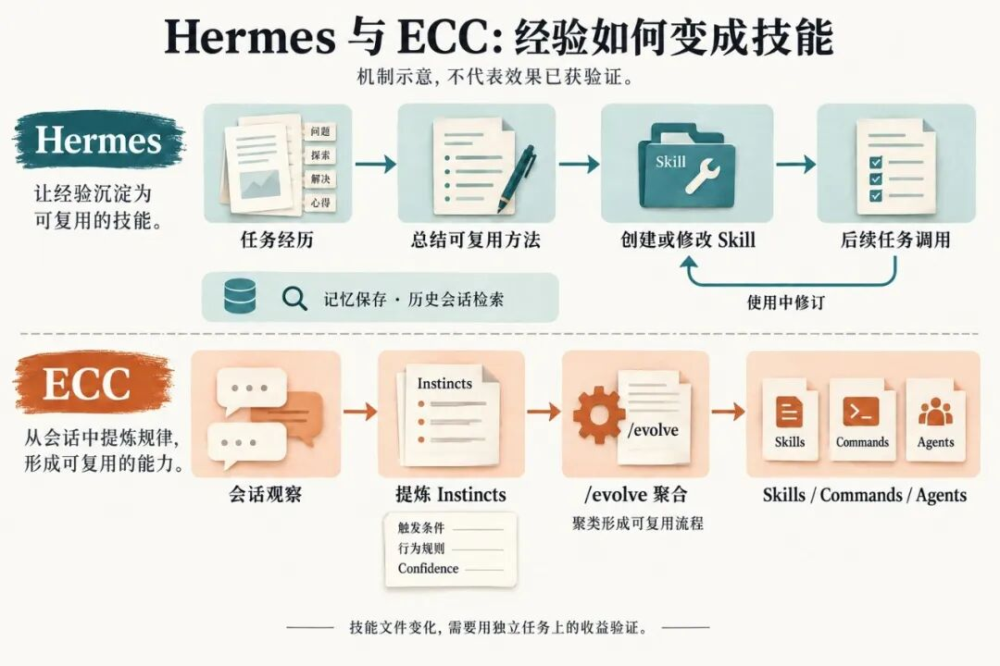
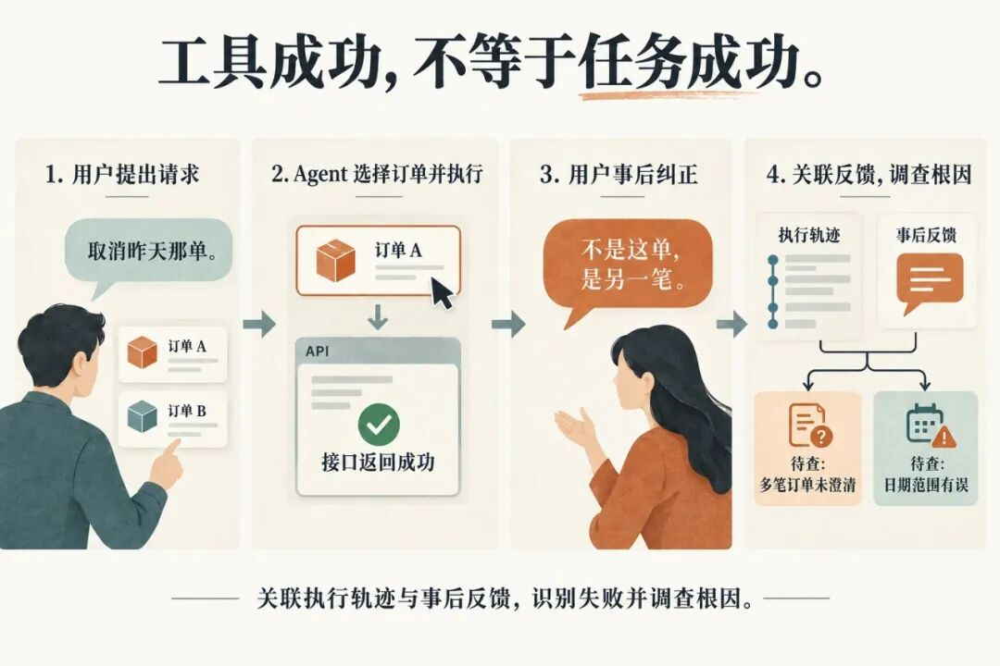
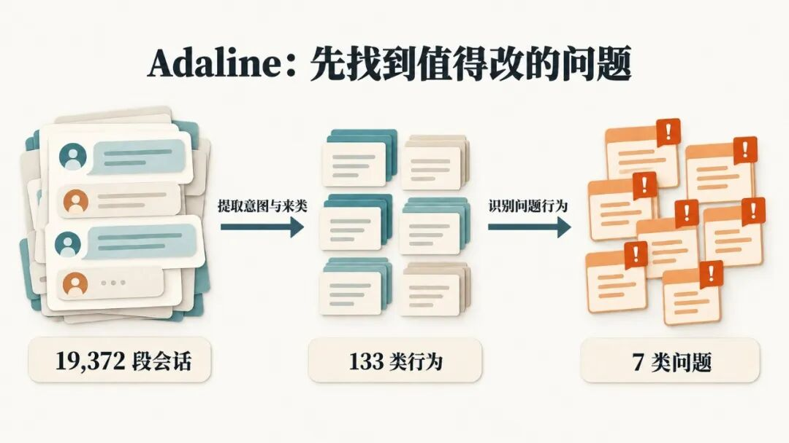
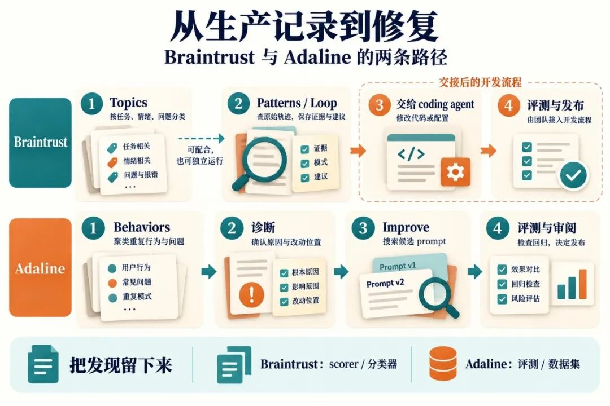
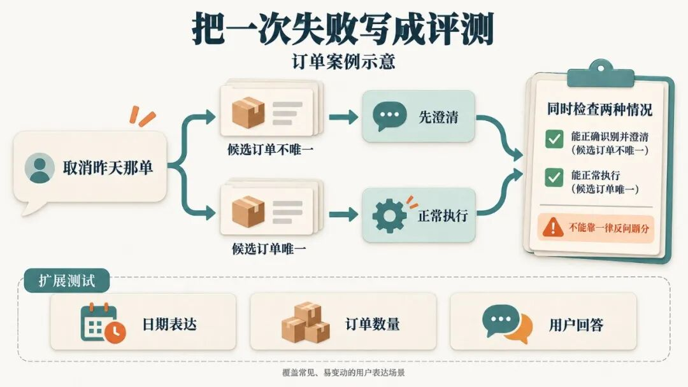
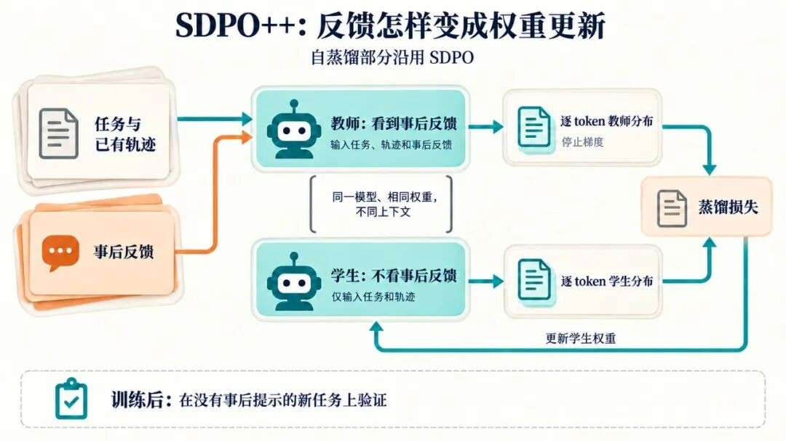
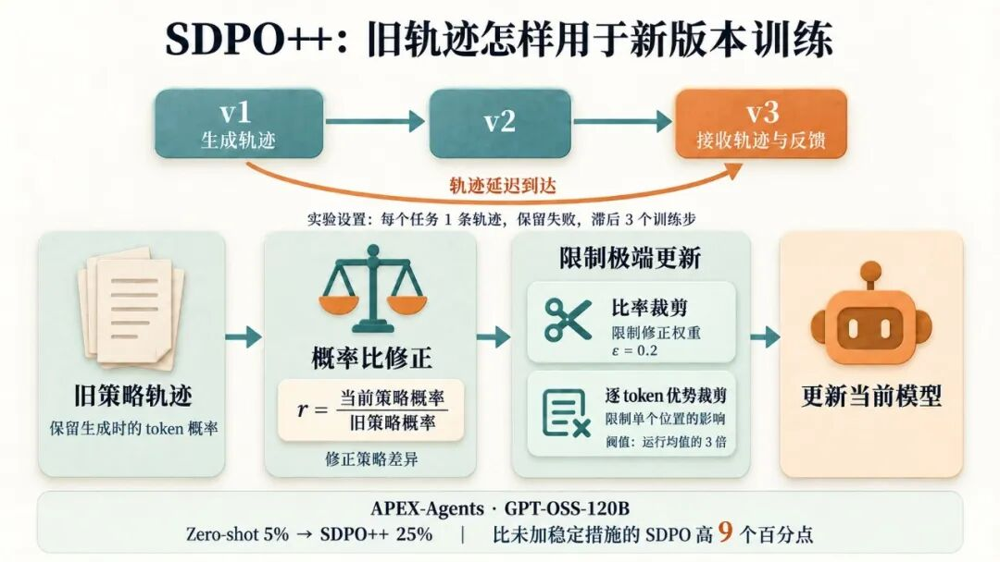

Hermes、ECC 这类开源 Agent 会把任务经验写成 skill，留给下次使用。Demo 展示了这套循环；学术论文接着用 benchmark 去测：改了执行框架或模型权重之后，Agent 到底有没有进步。

到了工业界，团队每天还要处理评测之外的新请求。Braintrust 让 Agent 调查生产记录，带着证据提出修复建议；Adaline 把问题接进 prompt 搜索与评测；Trajectory 则关联执行轨迹和事后反馈，用来研究权重更新。新的任务和用户反馈，是团队决定下一轮改什么的依据。

01

### 先验证改完有没有用

Hermes 自称 self-improving agent，会保存记忆、检索历史会话，从复杂任务中创建和修改 skills。ECC 从会话中提炼带 confidence 的 instincts，再通过 /evolve 聚合成 skills、commands 或 agents。

Agent 可能把一次偶然成功总结成通用规则，也可能围着同一次失败反复修改 skill。文件变多了，新任务做得怎么样，还得单独测。

学术界在这点上稍微靠谱些，至少要拿出分数。读这些实验，要看新旧版本是否使用相同底座和预算，测试题是否参与过优化。留出任务测泛化，重复运行看波动，消融实验则检查新增机制贡献了多少收益。

**改执行框架的研究**包括 SICA、Self-Harness 和 Meta-Harness。SICA 修改自身代码并评估候选版本；Self-Harness 根据失败轨迹修改 harness，通过回归检查后接受；Meta-Harness 搜索执行框架，其文本分类消融实验显示，让优化 Agent 访问原始轨迹，比只给分数或摘要更有效。

**改权重的研究**也在利用反馈。SDPO 让同一模型看到运行错误、评判意见等信息，充当事后知情的教师，再将其输出分布蒸馏回原策略；SDFT 用看到示范的模型给教学信号，研究学新技能时如何减少遗忘。

第一方工具也在补离线验证：Anthropic 的 skill-creator 支持有无 skill 的对照和版本盲评，OpenAI Codex 的指南则建议记录执行过程，结合程序检查与评分规则，并随真实失败扩展测试集。

02

### 离线验证之后，还有真实世界

从 benchmark 到生产环境，也有类似 sim-to-real 的落差。离线题目和工具环境覆盖不了用户的全部需求。

真实用户会说含糊的话，还会临时改需求。测试环境可以重置，线上操作却可能无法撤销；权限、并发和服务状态也会变化。团队除了看任务完成率，还得算等待时间、费用，以及用户被反复追问的次数。

假设用户让订单 Agent“取消昨天那单”。Agent 选了订单 A，调用取消接口，返回成功。用户随后说：“不是这一单，是另一笔。”

如果团队只检查接口返回，就会把这次操作记为成功。对照用户纠正和执行记录，才查得出 Agent 是没澄清多笔订单，还是算错了日期、时区。前者要改决策，后者要修日期处理。

Anthropic 在评测指南中也用了退款案例：既检查回复是否依据查询到的政策，也检查工单和退款的实际状态。离线评测可以验证这些结果；上线后，还需要从真实用户反馈中发现评测漏掉的目标与约束。

更多真实任务能暴露事先没想到的问题，执行记录帮助定位出错步骤，用户纠正则补充了模型反思时不知道的信息。不过，反馈仍需要筛选：用户没投诉不代表做对了，服务中断也不能归因于 Agent 策略。

团队可以据此补充离线测试，再用后续请求检查修复。模拟任务有助于扩展测试范围，但如果模拟环境漏掉了关键约束，多生成一些题也补不上这个缺口。

03

### Braintrust 与 Adaline：挖出问题，交给谁改

一万条 trace 摆在面前，先看哪条？已有评测只能筛出已知错误。

Adaline 的 Running Coach 案例先提取会话意图，再聚类、命名：19,372 段会话整理成 133 类行为，其中 7 类标记为问题。行为目录里也有正常任务，不能把每个簇都当成 bug。

但知道“哪类请求很多”，离“该改哪里”还差一步。Braintrust 把这一步拆得更清楚。Topics 先从任务、情绪、问题等角度读每条 trace，分别写摘要，再聚类成主题；这样就能交叉筛选“退款请求里，用户不满且发生工具错误”的记录。

它的 Patterns 则让 Loop 查询日志、深入检查部分轨迹，记录有证据支持的发现和修复建议。后续遇到同类证据，更新已有发现。团队可以把发现连同证据复制给 coding agent 去修，也能让 Loop 将值得跟踪的问题转成 scorer 或分类器，持续检查新流量。

沿用订单例子，“取消请求”“负面情绪”只是筛选条件。查过订单列表、调用参数和用户纠正，才能判断 Agent 是否漏了多订单澄清。确认后保存代表性案例，写出检查规则，下次就不用从头翻日志。

Adaline 也会深入调查：它的编程 Agent 行为分析会给出诊断、建议和具体执行步骤的证据链接。例如“改完没验证”，要沿轨迹区分没运行测试、测试环境坏了，还是把读代码当成验证。各有修法。

Adaline 进一步把修复接进 Improve。每轮针对一个 prompt，调整指令、示例、模型设置或工具使用指导；检索过期、工具后端故障，则先修对应代码。对订单 Agent，漏了澄清规则可以改 prompt；取消接口有 bug，就得改代码。

Running Coach 案例中，系统围绕问题生成评测，用已知错误的输出变体检查评估器，再结合 GEPA 式反思优化和合成数据搜索候选 prompt。审阅者对照修改、回归结果、成本和延迟决定发布。公司报告完成了 30 多轮改进，验证涉及 776 个测试用例、23 个合成数据集。

评测仍要写具体：多笔订单时应澄清，唯一订单时应执行。只测前者，Agent 可能靠每次反问拿高分。团队可以围绕真实失败生成不同日期表达、订单数量和用户回答，再用独立真实请求检查遗漏。

04

### Trajectory：用轨迹和反馈更新权重

Trajectory 的 SDK 把消息、工具调用、奖励与指标组织成轨迹，通过 trace\_id 连接执行记录和产品反馈。收到“取消错了”时，能找回当时的候选订单、模型选择和工具调用。

训练方法是他们在 Scaling SDPO 中提出的 **SDPO++**：沿用 SDPO 的自蒸馏方法，再处理旧版本模型产生的数据。

训练时，同一个模型分别充当学生和教师。两者都看任务和轨迹前缀，教师额外看到用户纠正等事后提示。训练程序逐 token 比较两者的预测分布，把学生的预测向教师靠近；教师侧停止梯度，只提供目标。

沿用订单例子，教师看到“取消错了”后，可能降低直接取消的概率，更倾向于澄清。训练的目标是让学生在新任务里没有这条事后提示，也更容易作出合适的选择。

因此，一条失败轨迹也能用于训练，前提是事后提示确实有帮助。它不需要像 GRPO 那样，先为同一道题采样多条答案再比较高低。

用户反馈回来时，模型可能已经更新。Trajectory 用新旧策略的概率比修正这种差异，但少数 token 的比值过大会让训练失稳。SDPO++ 用重要性比率裁剪限制修正权重，再用逐 token 优势裁剪限制个别位置的更新贡献，防止少数极端值主导训练。

长任务会拖慢同步训练，团队把轨迹生成和训练分开调度，也就要处理不断到来的旧策略数据。

在 APEX-Agents 上，他们报告 GPT-OSS-120B 的通过率从未训练时的 5% 升至 25%，比未加稳定措施的 SDPO 高 9 个百分点。实验每个任务使用一条轨迹、保留失败，并设置三个训练步的滞后。

Trajectory 的路线图还提出联合优化权重、harness 和 prompts。同一种失败可以有不同修法：工具缺少参数，就改接口；指令遗漏业务规则，就补 prompt；模型反复做错已有信息足以判断的决策，再考虑权重更新。选择改哪一层，需要先沿着轨迹定位错误。

05

### 真实数据怎样支持下一轮改进

修好“多订单先澄清”之后，订单 Agent 还可能在时区、部分退款、订单状态变化上出错。团队要从后续请求中继续收集失败，判断该补评测、改配置，还是增加训练数据。

真实数据多了，团队能覆盖更多这样的失败，也能区分偶发错误和反复出现的问题，但还得像前面的挖掘流程那样，把重复案例归到一起，挑出值得修的新问题。重复一万次相同请求，和收集一万种不同约束下的请求，能学到的东西并不一样。日志里还需要有可关联的结果与纠正，否则只能知道 Agent 做了什么，不知道它做得对不对。

有足够流量时，团队可以做线上 A/B 实验：把用户或账户随机分组，分别使用旧版本和新版本，比较任务完成率、用户纠正率，同时检查成本、延迟和错误操作。订单例子里，新版本应当减少取消错单，也不能因为过度追问让更多用户放弃。

灰度发布控制放量范围，A/B 用来估计新版本带来的效果。仅比较上线前后的分数，可能把流量变化误认成模型进步。对会积累记忆或持续训练的 Agent，还要隔离两组的状态和更新数据。确认收益后再扩大使用范围，并把新出现的失败收进下一轮评测与更新。

Demo 能演示一次修改，论文能测出一组任务上的提升。生产系统要靠真实任务不断提供新的失败、约束和纠正，团队据此查清原因，更新评测与模型，再看后续业务结果。
